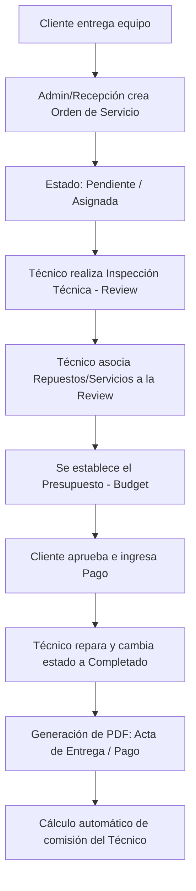

# Resumen del Proyecto: Electrónica App

Este documento presenta una radiografía detallada del sistema **Electrónica App** (referenciado internamente en algunas secciones como *Electronica Tp-Link*), un sistema web administrativo y de cara al público para la gestión integral de un centro de servicio técnico de dispositivos electrónicos y de redes, control de inventario, facturación de órdenes y cálculo automatizado de comisiones de técnicos.

---

## 1. ¿Qué hace el proyecto?

El proyecto es una **Plataforma de Gestión de Servicio Técnico y Ventas**. Administra todo el flujo operativo de un taller o centro de soporte especializado:

1. **Gestión de Órdenes de Servicio:** Registro y seguimiento del estado de los equipos recibidos (marcas, modelos, números de serie, accesorios con los que ingresa y notas adicionales) desde que entran en estado *Pendiente* hasta que se entregan (*Completado*).
2. **Revisiones Técnicas (Diagnóstico):** Registro de inspecciones técnicas por parte de los especialistas, donde detallan el fallo, el diagnóstico (`description_tec`), el presupuesto estimado (`budget`) y asocian los repuestos e intervenciones (servicios) requeridos.
3. **Control de Inventario y Catálogo:** Gestión unificada de productos físicos (repuestos, cables, routers) y de servicios intangibles (mano de obra, mantenimiento, formateo) mediante un indicador lógico (`is_service`).
4. **Módulo de Comisiones para Técnicos:** Liquidación automatizada de las comisiones que corresponden a cada técnico por las reparaciones efectuadas. El sistema calcula periódicamente (quincenas) el 30% (o la tasa configurada) del costo de los servicios realizados por cada técnico.
5. **Procesamiento de Pagos:** Registro de transacciones financieras asociadas a las órdenes, permitiendo diferentes divisas y métodos de pago (efectivo, tarjeta, transferencia), y controlando el estado de la cuenta por cobrar de cada orden.
6. **Generación de Documentación Oficial (PDF):** Emisión instantánea de recibos de pago, constancias de recepción de equipos, confirmación de retiro y órdenes de entrega.
7. **Importación/Exportación de Datos:** Facilidad para la migración de información mediante la exportación e importación de usuarios en formato Excel.
8. **Analíticas de Rendimiento:** Un panel gráfico (dashboard) que muestra KPIs de ingresos, órdenes completadas frente a nuevas, distribución de trabajo por técnico, métodos de pago predilectos, servicios más rentables y velocidad promedio de resolución de los empleados.
9. **Sitio Web Público:** Páginas informativas integradas (*Nosotros*, *Servicios*, *Precios* y *Contacto*) para captar potenciales clientes.

---

## 2. ¿Para quién está diseñado?

La plataforma está diseñada con un control de accesos basado en roles para satisfacer las necesidades de tres perfiles principales:

| Rol | Beneficiario | Funciones Principales |
| :--- | :--- | :--- |
| **Administrador / Dueño de Negocio** | Propietario del taller técnico | Visualiza analíticas financieras, gestiona tarifas y datos de la empresa, supervisa empleados, aprueba presupuestos grandes, exporta/importa datos a Excel y liquida comisiones. |
| **Técnico / Especialista** | Personal operativo del taller | Realiza las inspecciones y diagnósticos, añade repuestos y servicios utilizados en las reparaciones, actualiza el estado de las órdenes y consulta su histórico de comisiones devengadas. |
| **Cliente Final** | Usuario que solicita el soporte | Entrega sus equipos, recibe un comprobante PDF profesional, aprueba presupuestos y recibe notificaciones físicas u oficiales del estado de su equipo. |

---

## 3. Problema que ataca

El software soluciona los problemas más comunes en la administración de talleres de electrónica y soporte técnico:

* 🔴 **Desorden en la recepción de equipos:** Pérdida de accesorios (ej. cargadores, cables, tarjetas de memoria) o confusión de marcas y números de serie de los clientes.
* 🔴 **Cálculo de comisiones complejo y manual:** Los talleres técnicos suelen pagar a sus empleados un porcentaje de la mano de obra. Calcular esto quincena a quincena de manera manual en hojas de cálculo consume tiempo y se presta a errores de digitación.
* 🔴 **Falta de visibilidad sobre los tiempos de respuesta:** Dificultad para saber qué técnico es más eficiente o qué tipo de equipos/servicios demoran más en solucionarse.
* 🔴 **Ausencia de control financiero centralizado:** Problemas para saber qué órdenes han sido pagadas parcialmente, cuáles tienen deudas pendientes y qué métodos de pago son los más utilizados.
* 🔴 **Falta de formalidad comercial:** Tareas manuales para redactar comprobantes de ingreso, recibos y actas de entrega del dispositivo reparado.

---

## 4. Solución que ofrece

* 🟢 **Registro Estructurado del Equipo:** Ficha detallada de ingreso que incluye accesorios, descripción inicial del cliente y notas adicionales.
* 🟢 **Automatización Quincenal de Comisiones:** Motor que procesa las revisiones cerradas en periodos específicos, calcula la comisión por concepto de servicios y permite registrar la liquidación formal del pago al técnico.
* 🟢 **Flujo de Trabajo Digitalizado (Workflow):** Un flujo claro y restrictivo para el paso del equipo por las diferentes fases del taller.
* 🟢 **Generador PDF Integrado:** Plantillas limpias y automatizadas que generan comprobantes listos para imprimir o enviar digitalmente.
* 🟢 **Dashboard Estadístico e Interactivo:** Gráficas en tiempo real de carga de trabajo, distribución de órdenes y utilidades de productos/servicios.
* 🟢 **Estructura Híbrida SPA-MultiPage:** Gracias a Inertia.js, ofrece la velocidad de una SPA (Single Page Application) sin la complejidad de separar físicamente el backend y el frontend.

### Diagrama de Flujo del Proceso Operativo



---

## 5. Tech Stack (Pila Tecnológica)

El proyecto utiliza una de las combinaciones más modernas y recomendadas para el desarrollo rápido de aplicaciones web robustas:

### Backend
* **Lenguaje:** `PHP ^8.2`
* **Framework:** `Laravel ^12.0` (El framework PHP moderno por excelencia).
* **Autenticación:** `Laravel Breeze` (Implementación limpia con Inertia/Vue).
* **Seguridad y Roles:** `Spatie/laravel-permission` (Para el control granular de accesos de Administradores y Técnicos).
* **Generación de PDFs:** `Barryvdh/laravel-dompdf` (Wrapper de Dompdf para renderizar vistas HTML como PDF).
* **Gestión de Excel:** `Maatwebsite/excel` (Para la exportación e importación de reportes y catálogos).
* **Enrutamiento Frontend/Backend:** `Tightenco/ziggy` (Permite usar las rutas declaradas en Laravel directamente en los archivos Vue).

### Frontend
* **Framework Reactivo:** `Vue 3.5+` (Usando el Composition API `<script setup>`).
* **Puente (Bridge):** `Inertia.js ^2.0` (Permite conectar Laravel y Vue 3 directamente sin construir una API REST/GraphQL tradicional, optimizando la experiencia de usuario).
* **Compilador/Empaquetador:** `Vite ^6.2` (Para cargas ultrarrápidas en desarrollo y bundles optimizados en producción).
* **Diseño y Estilos:** `Tailwind CSS ^3.2 / ^4.0` (Incluyendo el plugin `@tailwindcss/forms` para un diseño de formularios consistente y estético).
* **Gráficas:** `Chart.js ^4.5` y `vue-chartjs ^5.3` (Para la renderización de métricas en el Dashboard y la página de Analíticas).
* **Componentes UI Especiales:** 
  - `@vuepic/vue-datepicker` (Para la selección avanzada de rangos de fechas).
  - `vue3-carousel` (Para deslizadores o carruseles interactivos).
  - `Axios` (Para peticiones asíncronas HTTP puntuales).

### Base de Datos
* **Soporte Relacional:** Preparado para interactuar con motores de bases de datos tradicionales como **MySQL** y **PostgreSQL** (el código incluye lógicas adaptativas para el cálculo de diferencias de tiempo según el driver de base de datos en uso).
* **Base de datos de desarrollo rápido:** Configurado para soportar `SQLite` en entornos de desarrollo local o testing rápido.

---

## 6. Estructura del Proyecto

El código fuente sigue el estándar del framework Laravel 11/12 integrado con Inertia y Vue, distribuyendo las responsabilidades de la siguiente manera:

```
electronica-app/
├── app/                              # Lógica principal del Backend (PHP)
│   ├── Http/
│   │   ├── Controllers/             # Controladores que gestionan las peticiones e interactúan con Inertia
│   │   │   ├── AnalyticsController.php   # Lógicas de cálculo para gráficas, top de ventas y KPI de empleados
│   │   │   ├── CommissionController.php  # Cálculo quincenal de comisiones de técnicos y registro de pagos
│   │   │   ├── DashboardController.php   # Indicadores del panel de control general
│   │   │   ├── OrderDocumentController.php # Generador de comprobantes en formato PDF
│   │   │   └── ... (Controllers de CRUDs de Clientes, Equipos, Productos, etc.)
│   │   └── Middleware/
│   └── Models/                       # Modelos Eloquent que representan las tablas de la base de datos
│       ├── User.php                  # Cuentas de acceso al sistema (relacionadas con roles)
│       ├── Employee.php              # Datos personales y laborales del staff técnico/administrativo
│       ├── Customer.php              # Información del cliente (identificado por DNI)
│       ├── Order.php                 # Órdenes de servicio técnico del equipo
│       ├── Review.php                # Diagnóstico/Inspección técnica (asocia productos y servicios)
│       ├── Payment.php               # Transacciones y abonos de las reparaciones
│       ├── Product.php               # Productos físicos (repuestos) y servicios (mano de obra)
│       └── CommissionPayout.php      # Registro de pagos de comisiones efectuados
│
├── database/                         # Migraciones de base de datos y sembradores (Seeders)
│   └── migrations/                  # Definición del esquema relacional de la BD
│
├── routes/                           # Definición de rutas del sistema
│   ├── web.php                       # Rutas web protegidas por autenticación de Inertia
│   └── auth.php                      # Rutas de login/registro (Breeze)
│
├── resources/                        # Capa del Frontend (Vue 3, Tailwind, JS)
│   ├── js/
│   │   ├── Pages/                   # Vistas/Páginas Vue renderizadas por Inertia
│   │   │   ├── Dashboard.vue        # Vista del panel administrativo principal
│   │   │   ├── Analytics/           # Gráficas de rendimiento, ventas y productividad
│   │   │   ├── Commissions/         # Interfaz para consultar y liquidar comisiones
│   │   │   ├── Orders/              # Listados y formularios de ingreso/edición de equipos
│   │   │   ├── Reviews/             # Formularios para la elaboración de diagnósticos técnicos
│   │   │   ├── Customers/           # CRUD de clientes y buscador por DNI
│   │   │   ├── Products/            # Gestión del catálogo de repuestos y servicios
│   │   │   ├── Welcome.vue          # Página de bienvenida / Redirección al Login
│   │   │   └── ... (Sobre Nosotros, Servicios, Precios, Contacto)
│   │   ├── Components/              # Componentes de Vue reutilizables (Botones, Modales, Tablas)
│   │   ├── Layouts/                 # Plantillas maestras de diseño (AuthenticatedLayout y GuestLayout)
│   │   ├── app.js                   # Inicialización y configuración de Inertia/Vue 3
│   │   └── ziggy.js                 # Rutas compartidas de Laravel para el frontend
│   └── css/                         # Hojas de estilo y directivas de Tailwind CSS
│
├── package.json                      # Manifiesto de dependencias Javascript
├── composer.json                     # Manifiesto de dependencias PHP y comandos de ejecución
└── vite.config.js                    # Configuración de compilación de activos de Vite
```

> [!NOTE]
> La aplicación está estructurada de tal manera que separa limpiamente la lógica de negocio (en los Modelos y Controladores de Laravel) de la interfaz de usuario (en las páginas Vue), utilizando InertiaJS como un puente transparente que elimina la necesidad de manejar manualmente tokens de API o llamadas complejas a endpoints independientes para refrescar las pantallas.
